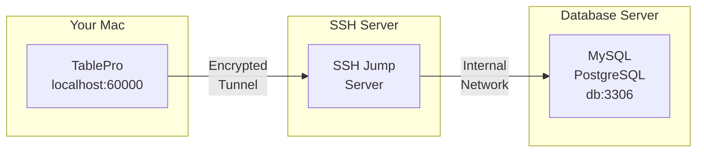
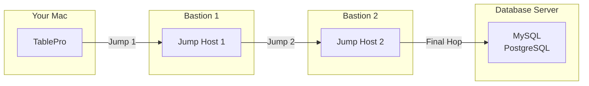

# SSH Tunneling

SSH tunneling routes your database connection through an encrypted tunnel to reach servers that aren't directly accessible from your Mac. TablePro manages the tunnel lifecycle, including keep-alive and auto-reconnect.

<Tip>
If you connect to multiple databases through the same SSH server, you can save your SSH configuration as a reusable profile. See [SSH Profiles](/features/ssh-profiles).
</Tip>

## How SSH Tunneling Works



## When to Use SSH Tunneling

- Database in private network
- Database accepts local connections only
- Need to encrypt database connection
- Access via bastion/jump host

## Setting Up

Open the connection form, switch to the **SSH Tunnel** pane, toggle **Enable SSH Tunnel** on, fill in the SSH server details and auth, then go back to **General** and click **Test Connection**.

{/* Screenshot: Connection form with SSH section expanded */}
<Frame caption="SSH tunnel configuration">
  
  
</Frame>

## SSH Configuration Options

### SSH Server Settings

| Field | Description | Default |
|-------|-------------|---------|
| **SSH Host** | SSH server hostname or IP | - |
| **SSH Port** | SSH server port | `22` |
| **SSH User** | SSH username | - |

### Authentication Methods

TablePro supports three SSH authentication methods:

<Tabs>
  <Tab title="Password">
    Simple password authentication:

    | Field | Description |
    |-------|-------------|
    | **SSH Pass** | Your SSH password |

    <Warning>
    Password authentication is less secure than key-based authentication. Use SSH keys for production servers.
    </Warning>
  </Tab>
  <Tab title="Private Key">
    Key-based authentication (more secure):

    | Field | Description |
    |-------|-------------|
    | **Key File** | Path to your private key (e.g., `~/.ssh/id_rsa`) |
    | **Passphrase** | Key passphrase (if encrypted) |

    <Tip>
    Click **Browse** to select your private key file. TablePro looks in `~/.ssh/` by default.
    </Tip>
  </Tab>
  <Tab title="SSH Agent">
    Delegates signing to an SSH agent process (1Password, Secretive, macOS `ssh-agent`). Keys stay in the agent and are never read by TablePro.

    | Field | Description |
    |-------|-------------|
    | **Agent Socket** | Dropdown with `SSH_AUTH_SOCK`, `1Password`, or `Custom Path` |

    - **SSH_AUTH_SOCK**: Uses the system `SSH_AUTH_SOCK` environment variable.
    - **1Password**: Uses 1Password's default socket path, `~/Library/Group Containers/2BUA8C4S2C.com.1password/t/agent.sock`.
    - **Custom Path**: Shows a text field so you can enter another agent socket path.

    <Tip>
    1Password also documents `~/.1password/agent.sock` as an easier alias to type, but that shortcut only works if you created it yourself. TablePro's **1Password** option uses the default path in `~/Library/Group Containers/...`.
    </Tip>
  </Tab>
</Tabs>

{/* Screenshot: SSH authentication methods */}
<Frame caption="SSH authentication: Password and Private Key options">
  
  
</Frame>

### Two-Factor Authentication (TOTP)

If your SSH server requires two-factor authentication via PAM (e.g., `google-authenticator`, `duo_unix`), TablePro can handle TOTP (Time-based One-Time Password) codes during login.

The TOTP option appears under **Two-Factor Authentication** when you select **Password** or **Keyboard Interactive** as your auth method.

<Tabs>
  <Tab title="Auto Generate">
    TablePro generates the TOTP code automatically at connect time using a secret you provide. No need to open an authenticator app.

    | Field | Description |
    |-------|-------------|
    | **TOTP Secret** | Your base32-encoded secret (the same key you used when setting up your authenticator app) |
    | **Algorithm** | Hash algorithm: SHA1 (default), SHA256, or SHA512 |
    | **Digits** | Code length: 6 (default) or 8 |
    | **Period** | Code rotation interval: 30 seconds (default) or 60 seconds |

    <Tip>
    The TOTP secret is the base32 string you got when first enrolling in 2FA. If you only have a QR code, most authenticator apps let you view the underlying secret.
    </Tip>
  </Tab>
  <Tab title="Prompt at Connect">
    TablePro shows a dialog asking for your verification code each time you connect. Use this if you prefer entering codes from your authenticator app manually.

    No additional configuration needed. Just select this mode and TablePro will prompt you when it needs the code.
  </Tab>
</Tabs>

**Setup steps:**

1. In the SSH tab of your connection settings, select **Password** or **Keyboard Interactive** as the auth method
2. Under **Two-Factor Authentication**, choose your TOTP mode
3. For Auto Generate: paste your base32-encoded TOTP secret

TOTP works with common PAM configurations including `google-authenticator`, `duo_unix`, and similar modules.

### Host Key Verification

TablePro verifies SSH host keys to protect against man-in-the-middle attacks. On first connection to a server, you'll see the server's fingerprint and can choose to trust it. The key is then stored locally.

If a previously trusted server's host key changes, TablePro shows a warning. This could mean the server was reinstalled, or it could indicate a security issue. You can choose to accept the new key or abort the connection.

### Using SSH Config

If you have entries in `~/.ssh/config`, TablePro reads them automatically:

1. TablePro reads your SSH config on launch
2. Select a host from the **SSH Host** dropdown
3. Settings are auto-filled from your config

Example SSH config entry:

```
# ~/.ssh/config
Host production-jump
    HostName jump.example.com
    User deploy
    Port 22
    IdentityFile ~/.ssh/production_key
```

This appears as "production-jump" in the SSH Host dropdown.

{/* Screenshot: SSH config hosts */}
<Frame caption="SSH hosts imported from ~/.ssh/config">
  
  
</Frame>

## Database Connection Settings

When using SSH tunneling, the database host is relative to the SSH server:

| Field | Value | Description |
|-------|-------|-------------|
| **Host** | `localhost` or `127.0.0.1` | Database is on the SSH server itself |
| **Host** | `db.internal` | Database is on internal network |
| **Port** | `3306`, `5432`, etc. | Database port (unchanged) |

<Note>
The database host should be what the SSH server uses to reach the database, not what your Mac would use.
</Note>

### Common Scenarios

#### Database on SSH Server

The database runs on the same machine as your SSH server:

```
SSH Host:       jump.example.com
SSH User:       deploy

Database Host:  localhost
Database Port:  3306
```

#### Database on Internal Network

The database is on a different server, only accessible from the SSH server:

```
SSH Host:       jump.example.com
SSH User:       deploy

Database Host:  db.internal.example.com
Database Port:  5432
```

#### AWS RDS via Bastion

Connecting to RDS through an EC2 bastion host:

```
SSH Host:       bastion.example.com
SSH User:       ec2-user
Key File:       ~/.ssh/aws-key.pem

Database Host:  mydb.abc123.us-east-1.rds.amazonaws.com
Database Port:  5432
```

## Multi-Jump SSH (ProxyJump)

When a database server sits behind multiple bastion hosts, TablePro can chain SSH hops using OpenSSH's `-J` (ProxyJump) flag. A single `ssh` process handles all intermediate jumps.



### Setting Up Multi-Jump

1. Open the connection form and switch to the **SSH Tunnel** pane
2. Enable SSH and configure the **final SSH server** (the one that can reach the database)
3. Expand the **Jump Hosts** section below the authentication settings
4. Click **Add Jump Host** and fill in each intermediate bastion host in order
5. Hosts are connected in sequence: first jump host is reached from your Mac, each subsequent host is reached through the previous one

### Jump Host Settings

Each jump host has:

| Field | Description |
|-------|-------------|
| **Host** | Hostname or IP of the jump host |
| **Port** | SSH port (default `22`) |
| **Username** | SSH username for this hop |
| **Auth Method** | **Private Key** or **SSH Agent** (password auth is not supported for jump hosts) |
| **Key File** | Path to private key (if using Private Key auth) |

### Example: Two Bastion Hosts

```
Jump Host 1:    admin@bastion1.example.com:22    (SSH Agent)
Jump Host 2:    tunnel@bastion2.internal:2222     (Private Key)

SSH Server:     deploy@final-ssh.internal:22
Database Host:  db.internal:5432
```

This produces the equivalent of:
```bash
ssh -J admin@bastion1.example.com:22,tunnel@bastion2.internal:2222 deploy@final-ssh.internal
```

### SSH Config Integration

TablePro reads `ProxyJump` directives from `~/.ssh/config`. When you select a config host that has `ProxyJump` set, the jump hosts are auto-filled.

```
# ~/.ssh/config
Host production-db
    HostName final-ssh.internal
    User deploy
    ProxyJump admin@bastion1.example.com,tunnel@bastion2.internal:2222
```

<Note>
Jump hosts only support **Private Key** and **SSH Agent** authentication. Password authentication is not available for intermediate hops because OpenSSH's `-J` flag does not support interactive password prompts for jump hosts.
</Note>

## SSH Key Setup

Generate keys: `ssh-keygen -t ed25519`. Copy to server: `ssh-copy-id user@server`. Keys must be `chmod 600`.

## Import from URL

Skip the manual setup and paste a URL that encodes both SSH and database credentials. TablePro supports `+ssh` schemes for one-shot import.

For the full URL spec, see [Connection URL Reference](/databases/connection-urls#ssh-tunnel-format).

**Format:**

```
scheme+ssh://ssh_user@ssh_host:ssh_port/db_user:db_password@db_host/db_name?name=MyConnection&usePrivateKey=true
```

**Supported schemes:** `mysql+ssh`, `postgresql+ssh`, `postgres+ssh`, `mariadb+ssh`

**Example:**

```
mysql+ssh://root@123.123.123.123:1234/database_user:database_password@127.0.0.1/database_name?name=FlashPanel&usePrivateKey=true
```

This fills in:
- **SSH Host**: `123.123.123.123`, **SSH Port**: `1234`, **SSH User**: `root`
- **Database Host**: `127.0.0.1`, **Database User**: `database_user`, **Database**: `database_name`
- **Connection Name**: `FlashPanel`, **Auth Method**: Private Key

**Query parameters:**

| Parameter | Description |
|-----------|-------------|
| `name` | Sets the connection name |
| `usePrivateKey` | `true` to select Private Key authentication |
| `useSSHAgent` | `true` to select SSH Agent authentication |
| `agentSocket` | SSH agent socket path override, e.g. `~/Library/Group Containers/2BUA8C4S2C.com.1password/t/agent.sock` |

To import: click **New Connection** on the welcome screen, then **Import from URL...** in the chooser footer, and paste the URL. The form opens with everything pre-filled.

<Tip>
This format is compatible with TablePlus SSH connection URLs, so you can paste them directly when migrating.
</Tip>

## Troubleshooting

<Tip>
If you use SSH profiles, click **Test Connection** in the profile editor to verify SSH connectivity independently from the database connection. This helps isolate whether the problem is SSH or database-level.
</Tip>

### Connection Refused

**Symptoms**: "Connection refused" when testing SSH tunnel

**Causes and Solutions**:

1. **SSH server not running**
   ```bash
   # Test SSH connection directly
   ssh -v user@server
   ```

2. **Wrong port**
   - Verify SSH port (some servers use non-standard ports)
   - Check with server administrator

3. **Firewall blocking connection**
   - Ensure port 22 (or custom port) is open
   - Check both local and server firewalls

### Authentication Failed

**Symptoms**: "SSH authentication failed" or "Permission denied"

**For Password Authentication**:
1. Verify username and password
2. Check if password auth is enabled on server
3. Try connecting via terminal: `ssh user@server`

**For Key Authentication**:
1. Verify key file path is correct
2. Check key permissions (`chmod 600`)
3. Ensure public key is in server's `authorized_keys`
4. Verify passphrase (if key is encrypted)
5. Try connecting via terminal:
   ```bash
   ssh -i ~/.ssh/your_key user@server
   ```

### Private Key Errors

**"Private key file not found"**:
- Verify the path exists
- Use the Browse button to select the file

**"Private key file is not readable"**:
```bash
chmod 600 ~/.ssh/your_key
```

**"Wrong passphrase"**:
- Re-enter the passphrase
- Test key manually: `ssh-keygen -y -f ~/.ssh/your_key`

### Tunnel Established but Database Fails

If the SSH tunnel connects but the database connection fails:

1. **Verify database host is correct** (relative to SSH server)
   ```bash
   # From SSH server, test database connection
   ssh user@server "mysql -h localhost -u dbuser -p"
   ```

2. **Check database port**
   - Ensure port matches the database server's actual port

3. **Verify database credentials**
   - Username/password might be different from SSH credentials

### Tunnel Drops Periodically

TablePro uses keep-alive settings to maintain tunnels:

- `ServerAliveInterval=60`: send keep-alive every 60 seconds
- `ServerAliveCountMax=3`: disconnect after 3 missed responses

If tunnels still drop:
1. Check network stability
2. Verify server's `ClientAliveInterval` setting
3. Check for idle timeout settings on firewalls

{/* Screenshot: SSH tunnel active */}
<Frame caption="Active SSH tunnel status indicator">
  
  
</Frame>

## Security Best Practices

Use key-based authentication with Ed25519 or RSA 4096+ bits, protect keys with a passphrase, and never expose database ports directly to the internet. SSH Agent (1Password, Secretive, or `ssh-agent`) keeps private keys in a separate process. Use it instead of storing passphrases.
