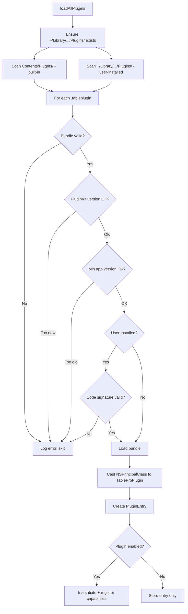

# PluginManager

`PluginManager` is a `@MainActor @Observable` singleton that handles plugin discovery, loading, registration, and lifecycle management.

**File**: `TablePro/Core/Plugins/PluginManager.swift`

## Loading Flow

Called once at app startup via `PluginManager.shared.loadAllPlugins()`.



### Step-by-step

1. **Directory setup**: Creates `~/Library/Application Support/TablePro/Plugins/` if missing.
2. **Scan**: Lists all `.tableplugin` items in both the built-in and user directories.
3. **Bundle creation**: `Bundle(url:)` -- fails if the bundle structure is invalid.
4. **Version check**: Reads `TableProPluginKitVersion` from Info.plist. Rejects if higher than `PluginManager.currentPluginKitVersion` (currently `1`). Throws `incompatibleVersion(required:current:)`.
5. **App version check**: If `TableProMinAppVersion` is set, compares against the running app version using `.numeric` string comparison. Throws `appVersionTooOld(minimumRequired:currentApp:)` with the actual version strings if the app is too old.
6. **Code signature** (user-installed only): Calls `verifyCodeSignature(bundle:)` which throws `PluginError.signatureInvalid(detail:)` on failure. See [Code Signature Verification](#code-signature-verification).
7. **Load executable**: `bundle.load()` -- loads the Mach-O binary into the process.
8. **Principal class**: Casts `bundle.principalClass` to `TableProPlugin.Type`.
9. **Entry creation**: Stores a `PluginEntry` with metadata (name, version, source, capabilities, enabled state).
10. **Registration**: If enabled, instantiates the class and calls `registerCapabilities()`.

The `loadPlugin(at:source:)` method is `@discardableResult` and returns the `PluginEntry` directly.

## Registration

### Capability-Gated Registration

Registration checks the plugin's declared `capabilities` array before registering for each protocol:

```swift
let declared = Set(type(of: instance).capabilities)

if let driver = instance as? any DriverPlugin {
    if !declared.contains(.databaseDriver) {
        // Log warning, but register anyway (lenient mode)
    }
    let typeId = type(of: driver).databaseTypeId
    driverPlugins[typeId] = driver
    for additionalId in type(of: driver).additionalDatabaseTypeIds {
        driverPlugins[additionalId] = driver
    }
}
```

The `driverPlugins` dictionary maps type ID strings to `DriverPlugin` instances. It is a regular `@MainActor`-isolated property on `PluginManager`. `DatabaseDriverFactory` is also `@MainActor`, ensuring safe access to `driverPlugins` without data races.

### Capability Validation

`validateCapabilityDeclarations()` runs at load time for each plugin and checks both directions:

- Plugin declares `.databaseDriver` but doesn't conform to `DriverPlugin` -- logs warning
- Plugin declares `.exportFormat` but doesn't conform to `ExportFormatPlugin` -- logs warning

This catches configuration mistakes early. Registration is lenient (proceeds with a warning) to avoid breaking third-party plugins that forget to declare capabilities.

### Unregistration

When a plugin is disabled, `unregisterCapabilities(pluginId:)` removes **all** entries from `driverPlugins` that were registered by that plugin. This includes both the primary type ID and any additional type IDs:

```swift
private func unregisterCapabilities(pluginId: String) {
    driverPlugins = driverPlugins.filter { _, value in
        guard let entry = plugins.first(where: { $0.id == pluginId }) else { return true }
        if let principalClass = entry.bundle.principalClass as? any DriverPlugin.Type {
            let allTypeIds = Set([principalClass.databaseTypeId] + principalClass.additionalDatabaseTypeIds)
            return !allTypeIds.contains(type(of: value).databaseTypeId)
        }
        return true
    }
}
```

The `Set` ensures both the primary ID and all `additionalDatabaseTypeIds` are removed in one pass. For example, disabling the MySQL plugin removes both `"MySQL"` and `"MariaDB"` entries.

## Enable / Disable

```swift
func setEnabled(_ enabled: Bool, pluginId: String)
```

- Updates the `PluginEntry.isEnabled` flag.
- Persists the disabled set to `UserDefaults` under the key `"disabledPlugins"`.
- If enabling: instantiates the plugin class and registers capabilities.
- If disabling: unregisters capabilities (removes from `driverPlugins`).
- Posts `Notification.Name.pluginStateDidChange` with `userInfo: ["pluginId": pluginId]`.

Disabled plugins remain in the `plugins` array and their bundles stay loaded in memory. They just have no registered capabilities.

## Install / Uninstall

### installPlugin(from:)

```swift
func installPlugin(from zipURL: URL) async throws -> PluginEntry
```

1. Extracts the `.zip` archive to a temp directory using `/usr/bin/ditto`.
2. The `ditto` process runs asynchronously via `withCheckedThrowingContinuation` -- it does not block the calling thread with `waitUntilExit`.
3. Finds the first `.tableplugin` bundle in the extracted contents.
4. Verifies code signature on the extracted bundle.
5. Checks for conflicts with built-in plugins. If a built-in plugin already has the same bundle ID, throws `pluginConflict(existingName:)`.
6. Copies to `~/Library/Application Support/TablePro/Plugins/`.
7. Loads the plugin via `loadPlugin(at:source:)` and returns the entry directly from that call.

If a plugin with the same filename already exists in the user plugins directory, it is replaced.

### uninstallPlugin(id:)

```swift
func uninstallPlugin(id: String) throws
```

1. Finds the plugin entry by ID.
2. Rejects if the plugin is built-in (`PluginError.cannotUninstallBuiltIn`).
3. Unregisters capabilities.
4. Calls `bundle.unload()`.
5. Removes the entry from the `plugins` array.
6. Deletes the `.tableplugin` directory from disk.
7. Removes from the disabled plugins set.
8. Sets `needsRestart = true` (the UI shows a restart recommendation banner).

## Code Signature Verification

User-installed plugins must pass macOS code signature validation pinned to the app's team ID:

```swift
private func verifyCodeSignature(bundle: Bundle) throws
```

Uses Security.framework:

1. `SecStaticCodeCreateWithPath` to get a `SecStaticCode` reference. Throws `signatureInvalid(detail:)` if this fails.
2. `createSigningRequirement()` builds a `SecRequirement` pinned to the team ID: `anchor apple generic and certificate leaf[subject.OU] = "D7HJ5TFYCU"`.
3. `SecStaticCodeCheckValidity` with `kSecCSCheckAllArchitectures` and the team ID requirement. Throws `signatureInvalid(detail:)` if validation fails.

The `signingTeamId` static property holds the TablePro team identifier (`D7HJ5TFYCU`).

Error details come from `describeOSStatus(_:)`, which maps common Security.framework codes to readable strings:

| OSStatus | Description |
|----------|-------------|
| -67062 | bundle is not signed |
| -67061 | code signature is invalid |
| -67030 | code signature has been modified or corrupted |
| -67013 | signing certificate has expired |
| -67058 | code signature is missing required fields |
| -67028 | resource envelope has been modified |
| other | verification failed (OSStatus N) |

Built-in plugins skip this check because they are covered by the app's own code signature.

## Data Model

### PluginEntry

```swift
struct PluginEntry: Identifiable {
    let id: String              // Bundle identifier or filename
    let bundle: Bundle
    let url: URL
    let source: PluginSource    // .builtIn or .userInstalled
    let name: String
    let version: String
    let pluginDescription: String
    let capabilities: [PluginCapability]
    var isEnabled: Bool
}
```

### PluginSource

```swift
enum PluginSource {
    case builtIn
    case userInstalled
}
```

### PluginError

| Case | When |
|------|------|
| `invalidBundle(String)` | Bundle cannot be created or loaded |
| `signatureInvalid(detail: String)` | Code signature check failed, with human-readable OSStatus description |
| `checksumMismatch` | Future: content hash verification |
| `incompatibleVersion(required:current:)` | PluginKit version too new for the running app |
| `appVersionTooOld(minimumRequired:currentApp:)` | App version is older than the plugin's `TableProMinAppVersion` |
| `pluginConflict(existingName: String)` | User-installed plugin has the same bundle ID as a built-in plugin |
| `cannotUninstallBuiltIn` | Tried to uninstall a built-in plugin |
| `notFound` | Plugin ID not in registry |
| `noCompatibleBinary` | Future: universal binary check |
| `installFailed(String)` | Archive extraction or copy failed |

## PluginDriverAdapter

**File**: `TablePro/Core/Plugins/PluginDriverAdapter.swift`

Bridges `PluginDatabaseDriver` (plugin side) to `DatabaseDriver` (app side). This is where transfer types are mapped:

- `PluginQueryResult` -> `QueryResult` (includes column type mapping from raw type name strings to `ColumnType` enum)
- `PluginColumnInfo` -> `ColumnInfo`
- `PluginIndexInfo` -> `IndexInfo`
- `PluginForeignKeyInfo` -> `ForeignKeyInfo`
- `PluginTableInfo` -> `TableInfo`
- `PluginTableMetadata` -> `TableMetadata`
- `PluginDatabaseMetadata` -> `DatabaseMetadata`

The adapter also conforms to `SchemaSwitchable` and delegates `switchSchema(to:)` / `switchDatabase(to:)` to the plugin driver.

### Column Type Mapping

`PluginDriverAdapter.mapColumnType(rawTypeName:)` converts raw type name strings from plugins into the app's `ColumnType` enum. The mapping handles common SQL type names:

- `BOOL*` -> `.boolean`
- `INT`, `INTEGER`, `BIGINT`, etc. -> `.integer`
- `FLOAT`, `DOUBLE`, `DECIMAL`, etc. -> `.decimal`
- `DATE` -> `.date`
- `TIMESTAMP*` -> `.timestamp`
- `JSON`, `JSONB` -> `.json`
- `BLOB`, `BYTEA`, `BINARY` -> `.blob`
- `ENUM*` -> `.enumType`
- `GEOMETRY`, `POINT`, etc. -> `.spatial`
- Everything else -> `.text`
