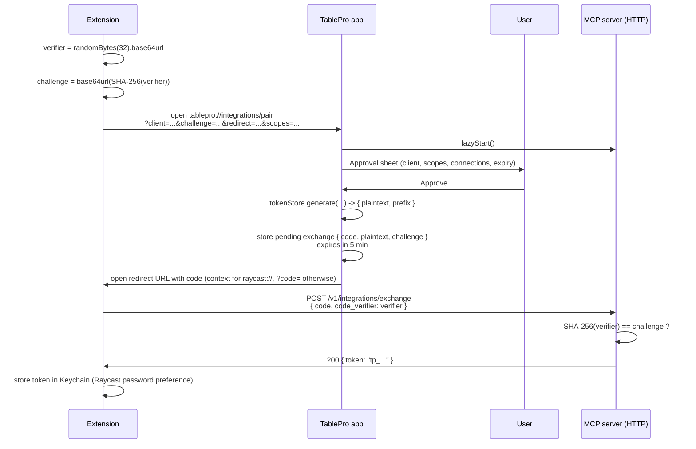

# Pairing

Pairing is how an extension gets a TablePro token without the user copying and pasting one. The user runs a `Pair with TablePro` command in the extension, picks scopes and connections inside TablePro, and the extension receives a token over a Raycast deep link callback.

The flow is PKCE-flavored: the extension generates a verifier, hashes it into a challenge, and the token is only released after the verifier is presented. This prevents another app on the same machine from intercepting the redirect and stealing the token.

## Sequence



## Step by step

### 1. Extension generates a verifier and challenge

```ts
import { randomBytes, createHash } from "node:crypto";

function base64url(buffer: Buffer): string {
  return buffer.toString("base64").replace(/\+/g, "-").replace(/\//g, "_").replace(/=+$/, "");
}

const verifier = base64url(randomBytes(32));
const challenge = base64url(createHash("sha256").update(verifier).digest());
```

The verifier is 32 random bytes, base64url-encoded. Keep it in memory until the exchange step. Do not log it.

### 2. Extension opens the pair deep link

```ts
import { open } from "@raycast/api";

const params = new URLSearchParams({
  client: `Raycast on ${require("os").hostname()}`,
  challenge,
  redirect: "raycast://extensions/ngoquocdat/tablepro/pair-callback",
  scopes: "readOnly,readWrite",
});
await open(`tablepro://integrations/pair?${params}`);
```

See the [URL scheme reference](/external-api/url-scheme#start-pairing) for parameters.

### 3. TablePro shows the approval sheet

The user sees:

- The client name from the request.
- A scopes radio (defaults to the requested scope, downgradeable).
- A connections multi-select (defaults to all unless `connection-ids` was provided).
- An expiry picker (defaults to never).

The user can change any of these before approving. The query parameters are a request, not a grant.

### 4. TablePro generates a token and a one-time code

On approval, TablePro calls `MCPTokenStore.generate(...)` to mint a token, then stores a pending exchange:

```swift
struct PendingExchange {
    let plaintextToken: String
    let challenge: String
    let expiresAt: Date  // now + 5 min
}
```

The plaintext token is held in memory only. The token store keeps the hashed form on disk (SHA-256 + salt).

### 5. TablePro redirects with the code

TablePro opens the `redirect` URL with `NSWorkspace.shared.open(...)`. The encoding depends on the redirect scheme:

- **`raycast://...`**: TablePro appends `?context={"code":"<uuid>"}` (URL-encoded JSON). Raycast parses `context` and passes it to the receiving command as `LaunchProps.launchContext`. This matches Raycast's documented launch-context convention.
- **Anything else** (`http://127.0.0.1:<port>/callback`, custom schemes): TablePro appends `?code=<uuid>` as a flat query parameter. Standard OAuth-callback shape.

### 6. Extension exchanges the code

The extension reads the MCP port from `~/Library/Application Support/TablePro/mcp-handshake.json`, then:

```ts
const port = await readHandshakePort();
const res = await fetch(`http://127.0.0.1:${port}/v1/integrations/exchange`, {
  method: "POST",
  headers: { "Content-Type": "application/json" },
  body: JSON.stringify({ code, code_verifier: verifier }),
});
const { token } = await res.json();
```

The exchange endpoint requires no bearer auth. The single-use code is the auth.

### 7. TablePro validates and returns the token

Server-side check:

```
SHA-256(code_verifier) == challenge
```

If equal, return the plaintext token and delete the pending exchange. If the code has expired (5 minutes) or the verifier does not match, return `403`.

### 8. Extension stores the token

```ts
import { LocalStorage } from "@raycast/api";
await LocalStorage.setItem("apiToken", token);
```

For preferences-backed storage, use `updateCommandMetadata` or write to the password preference. Tokens stored in Raycast preferences live in the macOS Keychain.

## Security properties

| Property | How |
|----------|-----|
| Token is never in the URL | The token is fetched over localhost HTTP, not embedded in a deep link. |
| Redirect interception is harmless | A malicious app that intercepts the `code` cannot exchange it without the verifier. |
| Code is single-use | Successful exchange or 5-minute expiry deletes the pending exchange. |
| Plaintext token is not persisted by TablePro | Only the SHA-256 hash plus salt is saved to `mcp-tokens.json`. |
| User sees and approves scopes | The sheet shows what was requested, what is granted, and which connections. |
| User can revoke any time | **Settings > Integrations > Authentication > Revoke**. |

## Errors

| Code | Meaning |
|------|---------|
| `403 challenge mismatch` | The verifier does not hash to the stored challenge. |
| `404 pairing code` | The code does not exist or has already been exchanged. |
| `410 expired` | The pending exchange is older than 5 minutes. |

A failed exchange is recorded in the activity log under the `auth` category with outcome `denied`.

### Denied approvals

If the user clicks **Deny** on the approval sheet, TablePro opens the `redirect` URL with two extra parameters so the extension can show a clear error and stop spinning:

- `error=denied`
- `error_description=user_denied`

For `raycast://...` redirects these are wrapped inside the standard `context` JSON payload (`{"error":"denied","error_description":"user_denied"}`); for any other scheme they are appended as flat query parameters.

Extensions should treat the presence of an `error` parameter on the callback as terminal and surface the description to the user.

## Implementing pairing in another extension

The flow is not Raycast-specific. Cursor, Claude Desktop, or any custom client can use it. Requirements:

1. Generate a verifier and challenge.
2. Open `tablepro://integrations/pair?...` with a deep link callback URL the OS can route back to the extension.
3. Read the MCP port from the handshake file.
4. POST `{ code, code_verifier }` to `/v1/integrations/exchange`.
5. Store the returned token in OS Keychain.

If the extension cannot register a custom URL scheme, open a localhost HTTP server on a chosen port and pass `http://127.0.0.1:<port>/callback` as the `redirect`.
